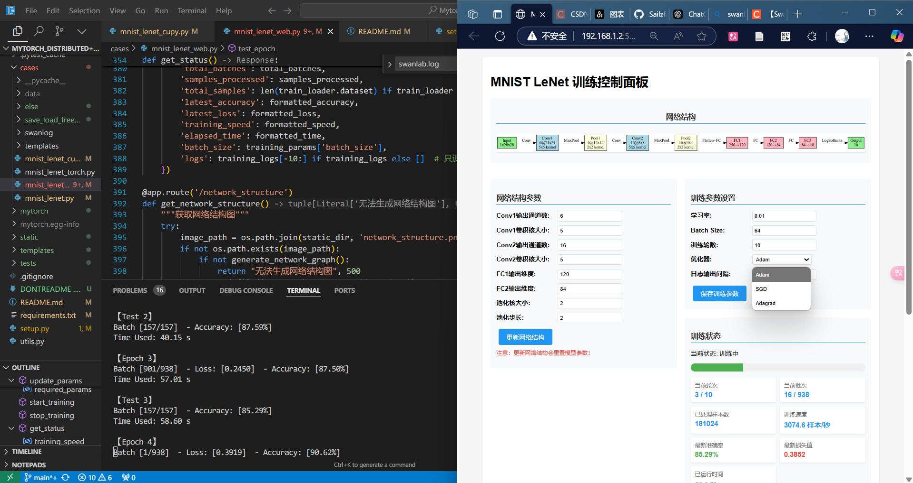

# MyTorch

自制深度学习框架 MyTorch，并支持 CPU 和 CUDA 加速，包含了使用不同网络结构对MNIST数据集进行分类的实验代码。

## 安装

1. 克隆仓库：
```bash
git clone git@github.com:Sailzf/Mytorch.git
```

2. 安装依赖：
swanlab：
看这个链接的1、2步：https://docs.swanlab.cn/guide_cloud/general/quick-start.htm

其他：
```bash
conda install xxx
```


## 使用方法（MNIST 数字分类，LeNet实现）
```bash
cd cases
```

1. MyTorch,CPU
```bash
python mnist_lenet.py
```

2. MyTorch,GPU
```bash
python mnist_lenet_cupy.py
```


3. MyTorch,GPU,WEB
**傻瓜式网络训练**

```bash
python cases/mnist_lenet_web.py
```
然后打开http://127.0.0.1:5000/，点击“开始训练”按钮，即可开始训练。

4. PyTorch, GPU
```bash
python cases/mnist_lenet_torch.py
```


